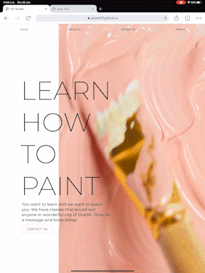
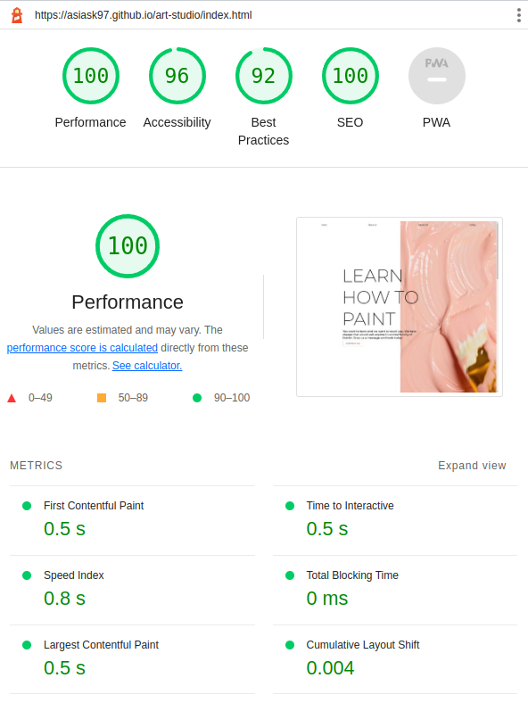
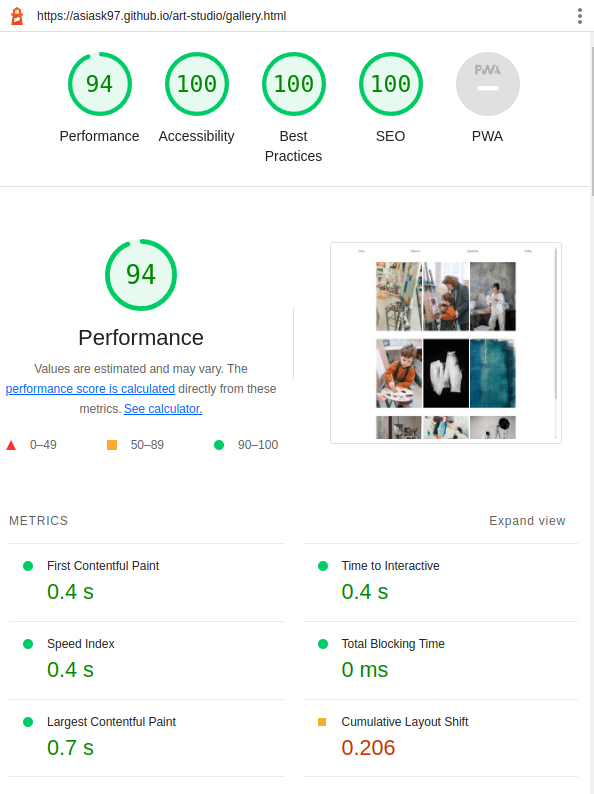

# **Art Studio** - HTML and CSS only project 
<br/>
<a href='https://asiask97.github.io/art-studio/'></a>

### [Live Webiste](https://asiask97.github.io/art-studio/)
<br/>
<br/>

# Table of Contents
    1. Introduction 
    2. Features
    3. UX 
    4. Testing
    5. Credits
    6. Deployment

# Introduction 
Art Studio is a small project that displays my knowledge of CSS and HTML as well as ability of designing unique and eye pleasing mobile-first webiste.<br/>
During the design stages I kept in mind the target audience which includes people who enjoy art and design. This is the reason why I have tried to keep the design modern and fresh. The whole website is company's business card which is why I only included the most relevant information which tells the visitor who the companyis, what they do and lets them contact the owner. 

**Time frame to finish this project was about 15-20 hours.**
<br/>
<br/>


# Features
## Navbar
I have decided to create a very simple navigation bar at the top with transparent background so the user is able to see and experience the hero video clearly with no interruptions. First 3 buttons on navbar take the user to a specific section of the page, where as the last one takes the user to another page with only the gallery.


## Heros section
Heros section is the heart of this website, I tried to make it interesting enough so the user will want to stay longer and find out whats this business is about. Very simple and minimalistic call to action gets a message across of what exactly this business does. The video in the background looks very interesting on a mobile but it also fit the minimalistic aesthetic on desktop.


The button takes the user straight down to contact form.


## About Us
The About Us section very shortly covers all relevant information that the business provides. On the right it also contains one of the images which advertise the compnay. It moves while the user is scrolling down to catch attention. See the gif below.




View Gallry button is placed under the image so the user can acess it if interested.

**Background for this section was designed and made by me.**

## Contact Us
The contact us section contains a simple form extending the minimalistic style of the whole website. Map below the form shows exact location of the business.


## Gallery
The gallery contains all relevant images - more can be added if such need arises. Each image contains short description which appears on hover. See image below.


## Footer
The footer contains 4 social media icons which open up in the new tab to make the user experience easier.

<br/>

# UX
My main goal though-out this project was to create a website in a short amount of time (a couple of hours) which will allow the user to find the most relevant information about a business of my choice and also represent its nature and through aesthetic and design but remain as original as possible.


This project is a classic example of a comapanys business card website. It has a simple Heros page with a call to action, navbar at the top and contact page with a map showing exact location of the business and a footer at the end which contains all social media links. Main content is in the middle which describes what the business does. Users are already accustomed to this website template which makes it easy for them to navigate.


I created a gallery on another sub-page so the main page only contains the most essential informations.


Form is validated through HTML to make sure user inputs correct information. See image below.


<br/>
<br/>

# Testing
Throughout the project I have kept in mind the performance and best practices. I made sure that my code passes all relevant tests like Validator tests shown below. I have also made sure that the website is fully responvie with help of Chrome developer tools.

List of devices which the website was testes on:
- IPhone SE
- IPhone XR
- IPhone 12 Pro
- Pixel 5
- Samsung Galaxy S8+
- Samsung Galaxy S20 Ultra
- Ipad Air
- Ipad Pro 2020
- Ipad Mini
- Surface Pro 7
- Surface Duo
- Galaxy Fold
- Samsung Galaxy A51/71
- Nest Hub Max

I have also made sure that the website works across a range of browsers like Chrome, Opera, Firefox and Brave.

Each button on the website was tested to make sure its works correctly and that all links are working and are fully functional. Tests were carried out to make sure that form is validating inputs correctly as previously discussed above. Smooth scrolling was added to make sure smoother user experience.

##  Validator Testing

- [HTML Validator - passed with no issues](https://validator.w3.org/nu/?doc=https%3A%2F%2Fasiask97.github.io%2Fart-studio%2F)
- [CSS Validator - passed with no issues](https://jigsaw.w3.org/css-validator/validator?uri=https%3A%2F%2Fasiask97.github.io%2Fart-studio%2F&profile=css3svg&usermedium=all&warning=1&vextwarning=&lang=en)

##  Lighthouse Testing

### Desktop - Home Page


### Desktop - Gallery Page


##  Issues
Throughout my testing the I encountered few minor issues:
- Responsiveness on Nest Hub. Can be adressed with relevant media queries.
- During testing with lighthouse on mobile performance score was lowered to 85 because of
- Render blocking recourses like google fonts being present.
- One image which was added as a background in css in .jpg format instead of AVIF. Unfortunately this issue is hard to resolve because CSS doesnt not support type declarations. This can be solved by using JavaScript but I wanted this project to be CSS and HTML only so I choose to leave the .jpg file as it has better browser compatibility.
## Fixes 
- To make sure that images can load faster and that the browser can pick the most relevant format itself I have used the fallowing code for each applicable image:
```
 </picture>
    <source
        type="image/avif"
        srcset="
        assets/images/gallery/gallery-img9-small.avif"/>
    <source
        type="image/webp"
        srcset="
        assets/images/gallery/gallery-img9-small.webp"/>
     
</picture>
```
- To hide overflow on whole body element but to keep its descendant element with position sticky working I have used **overflow-x: clip;**. This solution worked perfectly.

# Credits
Throughout this project I have tried to maintain its simplicity in order to show that I am more than able to design a not so simple website with only CSS and HTML in short amount of time. My other projects show many more advanced skills but I felt like its good to show the ability to use the simplest tools in a correct way.

I couldn't avoid using:


- [Google fonts were used to pick out fonts relevant to the design.](https://fonts.google.com/)
- [Bootstrap icons were used in the footer](https://icons.getbootstrap.com/)
- [Images and videos from pexels.com](https://www.pexels.com/)


# Deployment
To deploy this project I have decided to use Github pages as it is only a sample project not a official website.

To deploy I have made a Repo on gihub and pushed initial code. Then I have:

- Navigated to github Repo with with current project.
- Clicked Settings
- Navigate to Pages tab
- Choose branch correct branch
- Press Save button

Website is now live.