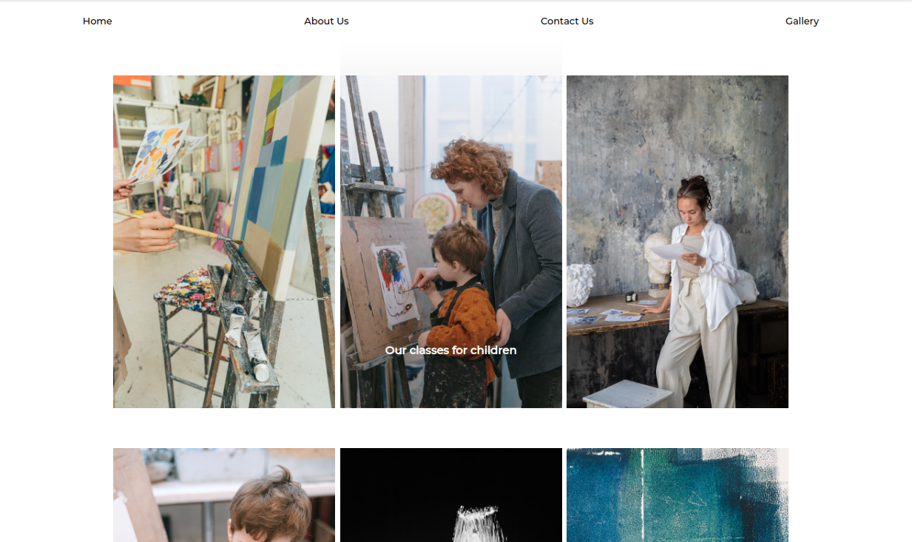
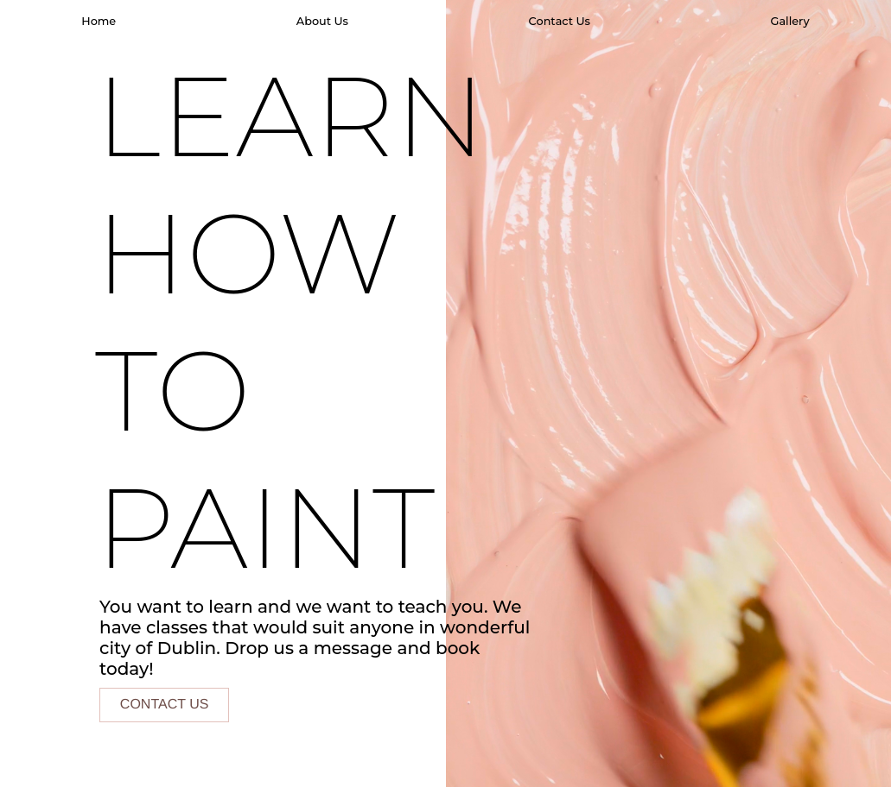

# **Art Studio** - HTML and CSS only project 
 

### [Live Webiste](https://asiask97.github.io/art-studio/)
 
 

# Table of Contents
    1. Introduction 
    2. UX 
    3. Features
    4. Testing
    5. Credits
    6. Deployment

# Introduction 
Art Studio is a small project that displays my knowledge of CSS and HTML as well as ability of designing unique and eye pleasing mobile-first webiste. 
During the design stages I kept in mind the target audience which includes people who enjoy art and design. This is the reason why I have tried to keep the design modern and fresh. The whole website is company's business card which is why I only included the most relevant information which tells the visitor who the companyis, what they do and lets them contact the owner. 

**Time frame to finish this project was about 15-20 hours.**
 
 

# UX
My main goal though-out this project was to create a website in a short amount of time (a couple of hours) which will allow the user to find the most relevant information about a business of my choice and also represent its nature and through aesthetic and design but remain as original as possible.

This project is a classic example of a comapanys business card website. It has a simple Heros page with a call to action, navbar at the top and contact page with a map showing exact location of the business and a footer at the end which contains all social media links. Main content is in the middle which describes what the business does. Users are already accustomed to this website template which makes it easy for them to navigate.

I created a gallery on another sub-page so the main page only contains the most essential informations.

Form is validated through HTML to make sure user inputs correct information. See image below.

FORM VALIDATION IMAGE
 

# Features
## Navbar
I have decided to create a very simple navigation bar at the top with transparent background so the user is able to see and experience the hero video clearly with no interruptions. First 3 buttons on navbar take the user to a specific section of the page, where as the last one takes the user to another page with only the gallery.

## Heros section
Heros section is the heart of this website, I tried to make it interesting enough so the user will want to stay longer and find out whats this business is about. Very simple and minimalistic call to action gets a message across of what exactly this business does. The video in the background looks very interesting on a mobile but it also fit the minimalistic aesthetic on desktop.

The button takes the user straight down to contact form.

## About Us
The About Us section very shortly covers all relevant information that the business provides. On the right it also contains one of the images which advertise the compnay. It moves while the user is scrolling down. See the gif below.

View Gallry button is placed under the image so the user can acess it if interested.

**Background for this section was designed and made by me.**

## Contact Us
The contact us section contains a simple form extending the minimalistic style of the whole website. Map below the form shows exact location of the business.

## Gallery
The gallery contains all relevant images - more can be added if such need arises. Each image contains short description which appears on hover. See image below.

## Footer
The footer contains 4 social media icons which open up in the new tab to make the user experience easier.

# Testing

# Credits
Throughout this project I have tried to maintain its simplicity in order to show that I am more than able to design a not so simple website with only CSS and HTML in short amount of time. My other projects show many more advanced skills but I felt like its good to show the ability to use the simplest tools in a correct way.

I couldn't avoid using:

- Google fonts were used to pick out fonts relevant to the design.

- Bootstrap icons were used in the footer
- Images and videos from pexels.com
# Deployment
