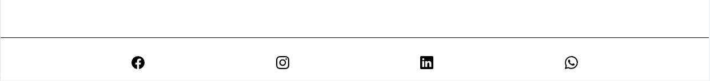

# **Art Studio** - HTML and CSS only project 
<br/>
<a href='https://asiask97.github.io/art-studio/'></a>

### [Live Webiste](https://asiask97.github.io/art-studio/)
<br/>
<br/>

# Table of Contents 
1. [Introduction](#-Introduction)
2. [User Stories](#-User-Stories)
3. [Features](#-Features)
4. [UX](#-UX)
5. [Testing](#-Testing)
6. [Credits](#-Credits)
7. [Deployment](#-Deployment)

# Introduction 
Art Studio is a small project that displays my knowledge of CSS and HTML as well as ability of designing unique and eye pleasing mobile-first website.<br/> 

During the design stages I kept in mind the target audience which includes people who enjoy art and design. This is the reason why I have tried to keep the design modern and fresh. The whole website is the company's business card, which is why I only included the most relevant information which tells the visitor who the company is, what they do and lets them contact the owner. 

**Time frame to finish this project was about 15-25 hours.**
<br/>
<br/>


# User Stories
### Some of user stories that got completed 

| #           | User Story      
| ----------- | ------------- 
| 1           | As a user I want to be able to easily navigate using the nav bar at the top of the page          
| 2           | As a user I want to be able to quickly find contact section       
| 3           | As a user I want to know what services the company provides        
| 4           | As a user I want to be able to find the company on a map            
| 5           | As a user I want to have an easy to use contact form            
| 6           | As a user I want to enjoy the aesthetics of the website           
| 7           | As a user I want to see gallery of images in high enough resolution not to see pixels           
| 8           | As a user I want to be able to watch a video of sample online class           
| 9           | As a user I want to find the company on social media           
| 10          | As a user I want to make sure that load times are as minimal as possible    
| 11          | As an owner I want to display my business in the best way possible        
| 12          | As an owner I want to have an original website  

<br/>
<br/>

### Some of user stories are planned for next sprint

| #           | User Story      
| ----------- | ------------- 
| 1           | As a user I want to book a class though the website          
| 2           | As a user I want to see all the schedules of classes    
| 3           | As an owner I want to be able to accept or reject clients    
| 4           | As an owner I want to let users register for newsletters           
| 5           | As an owner I want to have feedback from clients displayed on my page             

<br/>
<br/>

# Features
Below I will go over every feature of this website. The whole flow is best experienced by the user on the actual website. 
<br/>


<br/>
<br/>

## Navbar
I have decided to create a quite simple navigation bar at the top with transparent background, so the user is able to see and experience the hero video clearly with no interruptions.  All 5 buttons on navbar take the user to a specific section of the page. 


<br/>
<br/>

## Hero section
The hero section is the heart of this website, I tried to make it interesting enough so the user will want to stay longer and find out what this business is about. Quite simple and minimalistic call to action gets a message across of what exactly this business does. The video in the background looks interesting on a mobile but it also fits the minimalistic aesthetic on desktop. 

The button takes the user straight down to contact form.


<br/>
<br/>

## Our Teachers
The Teacher's section contains available teachers as well as a brief description of the most popular and common classes provided by the company. 4 teachers are displayed horizontally on tablets screens and up and vertically on small mobile screens 

<br/>
<br/>

## About Us
About us section has in-depth description of classes provided so even the most inexperienced user can understand what exactly happens in those classes. 

<br/>
<br/>

## Online Classes
The Online Classes section contains the reason the classes were moved online and a link to a sample class that is put on YouTube 

<br/>
<br/>

## Gallery
The gallery contains all relevant images - more can be added if such a need arises. Each image contains a brief description which appears on hover. See image below. 


<br/>
<br/>

## Contact Us
The contact us section contains a simple form extending the minimalistic style of the whole website. Map below the form shows the exact location of the business. Picture of this section is below in UX section. 
<br/>
<br/>


## Footer
The footer contains 4 social media icons which open in the new tab to make the user experience easier. 

<br/>
<br/>


## Form Submission
After the form is submitted a screen appears so the user knows that form was sent. 


<br/>
<br/>
<br/>
# UX
My main goal though-out this project was to create a website in a short amount of time (a couple of hours) which will allow the user to find the most relevant information about a business of my choice and represent its nature and through aesthetic and design but remain as original as possible. 
 

This project is a classic example of a company's business card website. It has a simple Heros page with a call to action, navbar at the top and contact page with a map showing exact location of the business and a footer at the end which contains all social media links. Main content is in the middle which describes what the business does. Users are already accustomed to this website template which makes it easy for them to navigate. 

 
I added a favicon at the top to keep the professional feel.  


Form is validated through HTML to make sure user inputs correct information. See image below.


<br/>
<br/>

# Testing
Throughout the project I have kept in mind the performance and best practices. I made sure that my code passes all relevant tests like Validator tests shown below. I have also made sure that the website is fully responsive with the help of Chrome developer tools. 


List of devices which the website was tested on: 
- IPhone SE
- IPhone XR
- IPhone 12 Pro
- Pixel 5
- Samsung Galaxy S8+
- Samsung Galaxy S20 Ultra
- Ipad Air
- Ipad Pro 2020
- Ipad Mini
- Surface Pro 7
- Surface Duo
- Galaxy Fold
- Samsung Galaxy A51/71
- Nest Hub Max

I have also made sure that the website works across a range of browsers like Chrome, Opera, Firefox and Brave.

Each button on the website was tested to make sure it works correctly and that all links are working and are fully functional. Tests were carried out to make sure that form is validating inputs correctly as previously discussed above. Smooth scrolling was added to make sure user experience smoother. 

##  Validator Testing
<br/>

- # [HTML Validator - passed with no issues](https://validator.w3.org/nu/?doc=https%3A%2F%2Fasiask97.github.io%2Fart-studio%2F)
- # [CSS Validator - passed with no issues](https://jigsaw.w3.org/css-validator/validator?uri=https%3A%2F%2Fasiask97.github.io%2Fart-studio%2F&profile=css3svg&usermedium=all&warning=1&vextwarning=&lang=en)
<br/>

##  Lighthouse Testing

### Desktop 


### Mobile 


##  Issues
Throughout my testing I encountered a few minor issues: 

- Responsiveness on Nest Hub. Can be addressed with relevant media queries. 

- During testing with lighthouse on mobile performance score was lowered to 89 because of render blocking recourses like google fonts being present. 

 
## Fixes 
- To make sure that images can load faster and that the browser can pick the most relevant format itself I have used the fallowing code for each applicable image:
```
 </picture>
    <source
        type="image/avif"
        srcset="
        assets/images/gallery/gallery-img9.avif"/>
    <source
        type="image/webp"
        srcset="
        assets/images/gallery/gallery-img9.webp"/>
     
</picture>
```
- To hide overflow on whole body element but to keep its descendant element with position sticky working I have used **overflow-x: clip;**. This solution worked perfectly.

- Could increase performance on mobile with JavaScript but I did not want to include it in my project 

# Credits
Throughout this project I have tried to maintain its simplicity to show that I am more than able to design a not so simple website with only CSS and HTML in a short amount of time. My other projects show many more advanced skills, but I felt like it is good to show the ability to use the simplest tools in a correct way. 

I couldn't avoid using:

- [Google fonts were used to pick out fonts relevant to the design.](https://fonts.google.com/)
- [Bootstrap icons were used in the footer](https://icons.getbootstrap.com/)
- [Images and videos from pexels.com](https://www.pexels.com/)
- [Definitions of Art Classes](https://en.wikipedia.org/)


# Deployment
To create A repository, I: 

- Loged into my account 
- Pressed plus on the left side 
- Clicked New repository button 
- Added a name of my repository 
- Made my repository public 
- Added a readme 
- Clicked create repository button 

 
Then I followed the commands that were given to me to make my first commit though CLI on Visual Studio Code. 

<br/>
To deploy this project, I have decided to use GitHub pages as it is only a sample project not a official website. 

To deploy I have made a Repo on GitHub and pushed initial code. Then I have: 

- Navigated to GitHub Repo with current project. 
- Clicked Settings 
- Navigate to Pages tab 
- Choose branch correct branch 
- Press Save button 

The website is now live. 